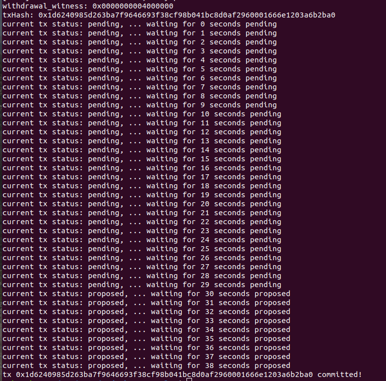

# Complete Withdrawal Process By Unlocking The Funds

A screenshot of the console output immediately after running the "unlock" command.

The Ethereum address that you've used for your Layer 2 account (in text format).

- Ethereum address: 0x4843f2ea764e98d1515BD988F5B0275C65094E5e

The Nervos Layer 1 address associated with the private key passed to "unlock" command (in text format). This is "ckb address" in the console output.

- Nervos layer 1 address: ckt1qyq9ckl458hfrn7xu4mphnqp274sz77r3sxq3q9ka2
