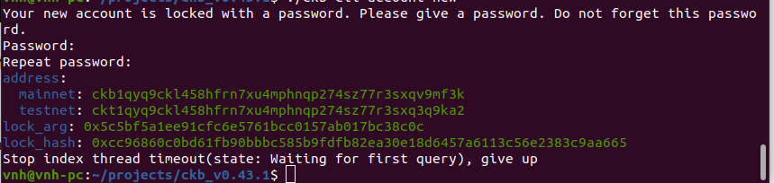
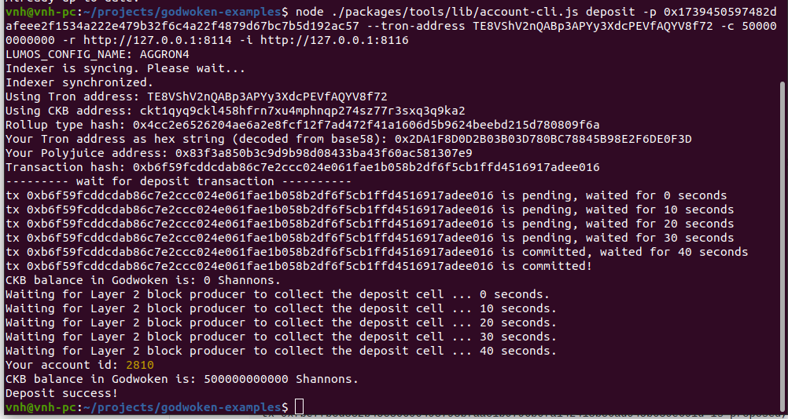
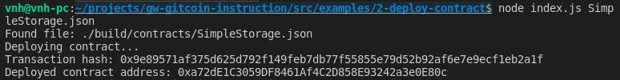

# Use A Tron Wallet To Execute A Smart Contract Call

A screenshot of the accounts you created (account list) in ckb-cli.



A link to the Layer 1 address you funded on the Testnet Explorer.

- Link: https://explorer.nervos.org/aggron/transaction/0x2c5c4581b43284d0005a0faff7826bddeea92b51d9baa04f1c56e5bd19c3064d

A screenshot of the console output immediately after you have successfully submitted a CKByte deposit to your Tron account on Layer 2.



A screenshot of the console output immediately after you have successfully issued a smart contract calls on Layer 2.



The transaction hash from the console output (in text format).

- Transaction hash: 0x9e89571af375d625d792f149feb7db77f55855e79d52b92af6e7e9ecf1eb2a1f

The contract address that you called (in text format).

- Contract address: 0xa72dE1C3059DF8461Af4C2D858E93242a3e0E80c

The ABI for contract you made a call on (in text format).

```
"abi": [
    {
      "inputs": [],
      "stateMutability": "payable",
      "type": "constructor"
    },
    {
      "inputs": [
        {
          "internalType": "uint256",
          "name": "x",
          "type": "uint256"
        }
      ],
      "name": "set",
      "outputs": [],
      "stateMutability": "payable",
      "type": "function"
    },
    {
      "inputs": [],
      "name": "get",
      "outputs": [
        {
          "internalType": "uint256",
          "name": "",
          "type": "uint256"
        }
      ],
      "stateMutability": "view",
      "type": "function"
    }
  ]
```

Your Tron address (in text format).

- Tron address: TE8VShV2nQABp3APYy3XdcPEVfAQYV8f72
