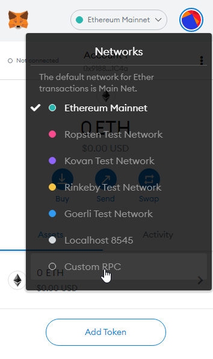
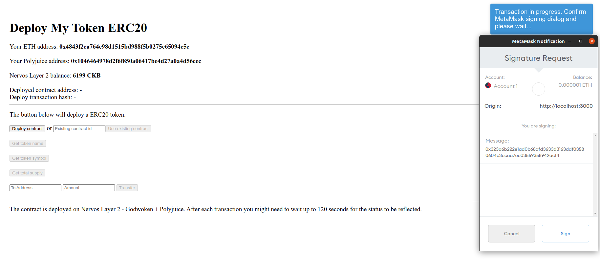

# Document Porting An Existing Ethereum DApp To Polyjuice

In this tutorial, you will learn about how to deploy and transfer a ERC20 token using UI.

### 1. Setup the Godwoken Testnet Network in MetaMask

Your MetaMask wallet will need to be configured to communicate with the Godwoken Layer 2 network. To do this, you will need to configure a new custom RPC. From the network selection dropdown, select "Custom RPC".



From there you will be presented with a form to specify the network settings.


Enter the following details.

```
Network Name: Godwoken Testnet
RPC URL: https://godwoken-testnet-web3-rpc.ckbapp.dev
Chain ID: 71393
Currency Symbol: <Leave Empty>
Block Explorer URL: <Leave Empty>
```

After MetaMask is configured you may see a zero balance even after you have deposited funds into this Ethereum address on Layer 2. Don't be alarmed by this. Later when you interact with the UI, you can see your ethereum address with your account balance.

### 2. Setting up your contract.

Clone the repository.

```
git clone git@github.com:vinhbhn/blockchain-workshop.git -b erc20-token
cd blockchain-workshop
```

This dapp require node >=14. You can find your nodejs version using command:
```node -v```.

And then run command ```yarn``` to install the dependencies.

In ```contracts/MyERC20Token.sol``` you need replace ```"<YOUR_TOKEN_NAME>"``` and ```"<YOUR_TOKEN_SYMBOL>"``` to your token and your symbol.

If you want to change the number of token mint to your liking, change the number ```10000000000000000000000``` to the number you want, remember that the default decimal of the token is 18 and you can convert it [here](https://eth-converter.com/).

Then run ```yarn build``` to compile the contract.

### 3. Install Polyjuice Dependencies
Now you will begin porting this Ethereum application to use Nervos' Layer 2. The first step is to install the required dependencies for working with Godwoken and Polyjuice.

```
yarn add @polyjuice-provider/web3@0.0.1-rc6 nervos-godwoken-integration@0.0.6
```

```@polyjuice-provider/web3``` is a custom Polyjuice web3 provider. It is required for interaction with Nervos' Layer 2 smart contracts.

```nervos-godwoken-integration``` is a tool that can generate Polyjuice address based on your Ethereum address. You might be required to use Polyjuice address if you store values mapped to addresses in your contracts.

### 4. Configure the Web3 Provider for the Polyjuice Web3 Provider

Here is the contents of the file ```src/config.ts``` that we just created:

```
export const CONFIG = {
    WEB3_PROVIDER_URL: 'https://godwoken-testnet-web3-rpc.ckbapp.dev',
    ROLLUP_TYPE_HASH: '0x4cc2e6526204ae6a2e8fcf12f7ad472f41a1606d5b9624beebd215d780809f6a',
    ETH_ACCOUNT_LOCK_CODE_HASH: '0xdeec13a7b8e100579541384ccaf4b5223733e4a5483c3aec95ddc4c1d5ea5b22'
};
```

You will use these config values in a moment, but first you need to import a few dependencies. You will need update the main UI in the file ```src/ui/app.tsx```

Next, you add the following lines in the main dependency importation section of the file.

```
import { PolyjuiceHttpProvider } from '@polyjuice-provider/web3';
import { CONFIG } from '../config';
```

This imports the Polyjuice Web3 Provider, which you will use in a moment, and the config file that we just created.

Next you prepare a few constants, create the Polyjuice Provider, and use the Polyjuice Provider with a Web3 instance.

```
const godwokenRpcUrl = CONFIG.WEB3_PROVIDER_URL;
const providerConfig = {
    rollupTypeHash: CONFIG.ROLLUP_TYPE_HASH,
    ethAccountLockCodeHash: CONFIG.ETH_ACCOUNT_LOCK_CODE_HASH,
    web3Url: godwokenRpcUrl
};
const provider = new PolyjuiceHttpProvider(godwokenRpcUrl, providerConfig);
const web3 = new Web3(provider || Web3.givenProvider);
```

The above code is a Web3 instance using a Polyjuice Web3 Provider. We will just call it "Polyjuice Web3" for short. You need to take this code and replace the existing Ethereum Web3 instance. In ```app.tsx```, locate the existing Web3 instance, which should match the line below.

```
const web3 = new Web3((window as any).ethereum);
```

Delete this line, and replace it with the Polyjuice Web3 code from above. Now your application is setup to communicate with Polyjuice using Web3!

### 5. Display Polyjuice Address in Your Application

Every Ethereum address can be translated into a Polyjuice address on Nervos' Layer 2. This can be done using the AddressTranslator class.

```
import { AddressTranslator } from 'nervos-godwoken-integration';
```

In ```src/ui/app.tsx```, you will see comment ```insert addressTranslator```. Now you can use the following code to insert into it.

```
const addressTranslator = new AddressTranslator();
const polyjuiceAddress = addressTranslator.ethAddressToGodwokenShortAddress(ethereumAddress);
```

### 6. View your Dapp

Run ```yarn ui``` and you can see the UI server at ```http://localhost:3000```, now you can open it in a browser. Once your browser is open, change your MetaMask network to Godwoken Testnet, which we setup earlier in this guide.

Now you can try out the application running on the Godwoken Testnet!


