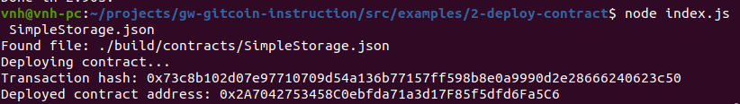

# Deploy A Simple Ethereum Smart Contract On Polyjuice

A screenshot of the console output immediately after you have successfully deployed a smart contract.

The transaction hash from the contract deployment (in text format).

- Transaction hash: 0x9e89571af375d625d792f149feb7db77f55855e79d52b92af6e7e9ecf1eb2a1f

The deployed contract address from the contract deployment (in text format).

- Deployed contract address: 0xa72dE1C3059DF8461Af4C2D858E93242a3e0E80c