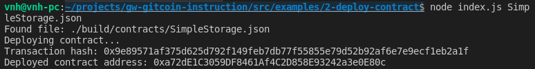

# Deploy A Simple Ethereum Smart Contract On Polyjuice

A screenshot of the console output immediately after you have successfully deployed a smart contract.

The transaction hash from the contract deployment (in text format).

- Transaction hash: 0x73c8b102d07e97710709d54a136b77157ff598b8e0a9990d2e28666240623c50

The deployed contract address from the contract deployment (in text format).

- Deployed contract address: 0x2A7042753458C0ebfda71a3d17F85f5dfd6Fa5C6