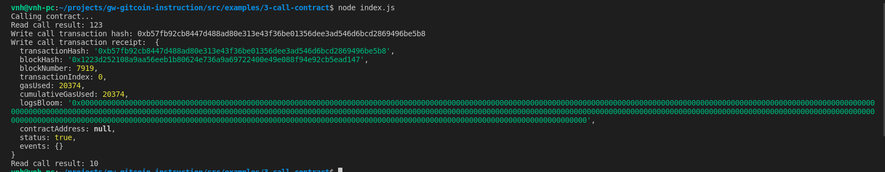

# Issue A Smart Contract Call To The Deployed Smart Contract

A screenshot of the console output immediately after you have successfully issued a smart contract call.



The transaction hash from the console output (in text format).

- Transaction hash: 0xb57fb92cb8447d488ad80e313e43f36be01356dee3ad546d6bcd2869496be5b8

The contract address that you called (in text format).

- Contract address: 0xa72dE1C3059DF8461Af4C2D858E93242a3e0E80c

The ABI for contract you made a call on (in text format).

```
[
    {
      "inputs": [],
      "stateMutability": "payable",
      "type": "constructor"
    },
    {
      "inputs": [
        {
          "internalType": "uint256",
          "name": "x",
          "type": "uint256"
        }
      ],
      "name": "set",
      "outputs": [],
      "stateMutability": "payable",
      "type": "function"
    },
    {
      "inputs": [],
      "name": "get",
      "outputs": [
        {
          "internalType": "uint256",
          "name": "",
          "type": "uint256"
        }
      ],
      "stateMutability": "view",
      "type": "function"
    }
  ]
```