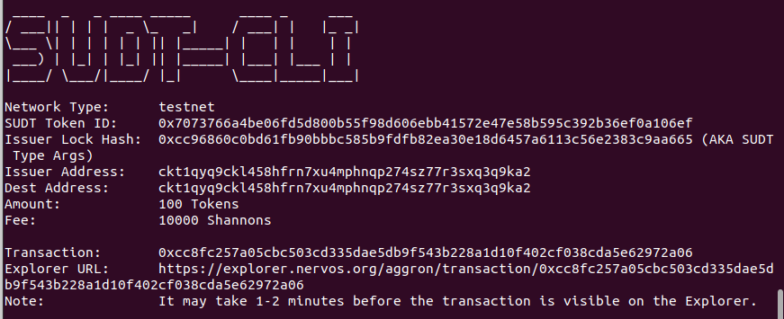
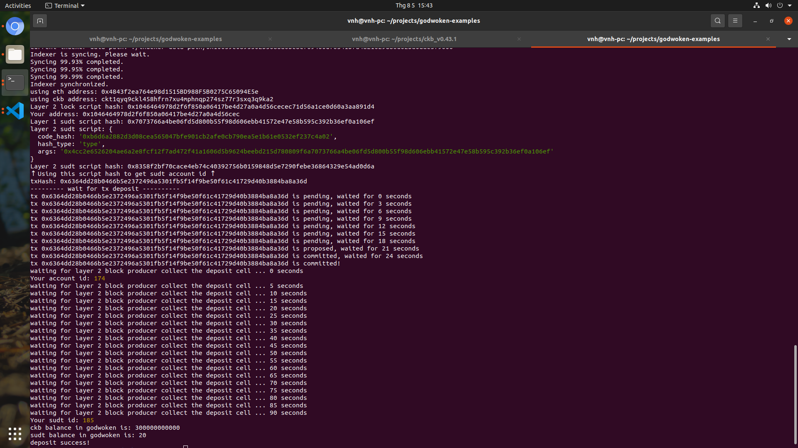

# Issue An SUDT Token On Layer 1 And Deposit It To Layer 2

A link to the Layer 1 address you funded on the Testnet Explorer.

- https://explorer.nervos.org/aggron/address/ckt1qyq9ckl458hfrn7xu4mphnqp274sz77r3sxq3q9ka2

A screenshot of the console output immediately after using sudt-cli to create your SUDT tokens on Layer 1.

A link to the transaction ID created by sudt-cli on the Testnet Explorer.

- https://explorer.nervos.org/aggron/transaction/0xcc8fc257a05cbc503cd335dae5db9f543b228a1d10f402cf038cda5e62972a06

A screenshot of the console output immediately after you have successfully submitted a deposit to Layer 2 using the account-cli tool.

The SUDT ID from the console output after executing the deposit script (in text format).

- Your sudt id: 185

