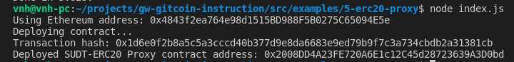
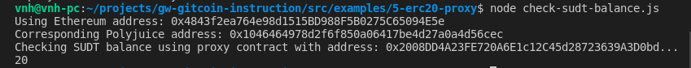

# Deploy The ERC20 Proxy Contract For The Deposited SUDT

A screenshot of the console output immediately after deploying smart contract.

The address of the ERC20 Proxy Contract you deployed (in text format).

- ERC20 Proxy Contract address: 0x2008DD4A23FE720A6E1c12C45d28723639A3D0bd

A screenshot of the console output immediately after checking your SUDT balance.

The Ethereum address that was checked (in text format).

- Ethereum address: 0x4843f2ea764e98d1515BD988F5B0275C65094E5e
