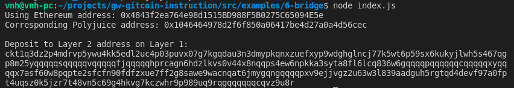

# Use Force Bridge To Deposit Tokens From Ethereum To Polyjuice

A screenshot of the console output immediately after you have successfully generated your Deposit Receiver Address.

Your Deposit Receiver Address (in text format).

- Deposit Receiver address: ckt1q3dz2p4mdrvp5ywu4kk5edl2uc4p03puvx07g7kgqdau3n3dmypkqnxzuefxyp9wdghglncj77k5wt6p59sx6kukyjlwh5s467qgp8m25yqqqqqsqqqqqvqqqqqfjqqqqqhprcagn6hdzlkvs0v44x8nqqps4ew6npkka3syta8fl6lcq836w6gqqqqpqqqqqqcqqqqqxyqqqqx7asf60w8pqpte2sfcfn90fdfzxue7ff2g8sawe9wacnqat6jmygqngqqqqpxv9ejjvgz2u63w3l839aadguh5rgtqd4devf97a0fpt4uqsz0k5jzr7t48vn5c69g4hkvg7kczwhr9p989uq9rqgqqqqqqcqvz9u8r

The Ethereum address used to generate the Deposit Receiver Address (in text format).

- Ethereum address: 0x4843f2ea764e98d1515BD988F5B0275C65094E5e

A link to the Etherscan explorer for the successful Force Bridge transaction.

- Link: https://rinkeby.etherscan.io/tx/0x716e65cc99653cd510af13e0ef40648d98b741a8ac6e91ac6e103c20105efdc9

A link to the Nervos explorer for the successful Force bridge transaction. 

- Link: https://explorer.nervos.org/aggron/transaction/0x851083a66a688c3b49ecc8feca0cceb04f578b6ec52fa96e5d9b35c0ee9d64db
