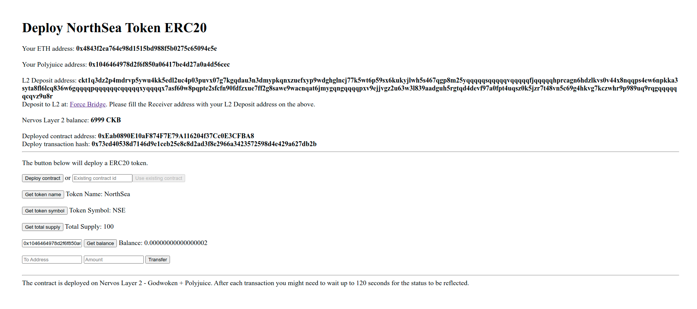

# Modify The Ported DApp So It Supports Ethereum Assets Via Force Bridge

A screenshot or video of your EVM application on Layer 2 with Force Bridge support.

The address of the SUDT-ERC20 Proxy Contract that you deployed (in text format).

- SUDT Proxy Contract: 0xEab0890E10aF874F7E79A116204f37Cc0E3CFBA8

A link to the GitHub repository with your EVM application that integrates Force Bridge support.

- Github URL: https://github.com/vinhbhn/blockchain-workshop/tree/ns-token-t8
