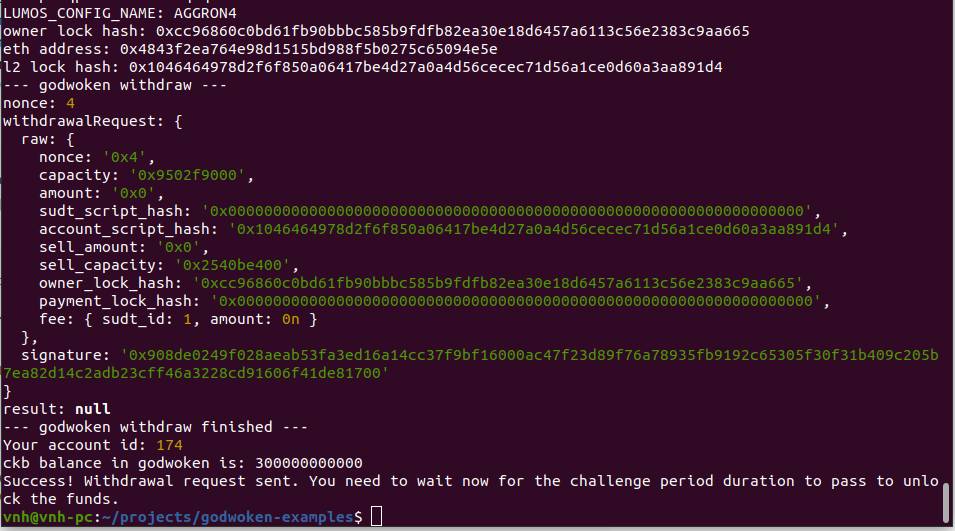

# Initiate Withdrawal Process From The Layer 2 Back To Layer 1

A screenshot of the console output immediately after running the withdraw command.

The Ethereum address that you've used for your Layer 2 account (in text format).

- Ethereum address: 0x4843f2ea764e98d1515BD988F5B0275C65094E5e

The Nervos Layer 1 address that you passed to withdraw command (in text format).

- Nervos address: ckt1qyq9ckl458hfrn7xu4mphnqp274sz77r3sxq3q9ka2
